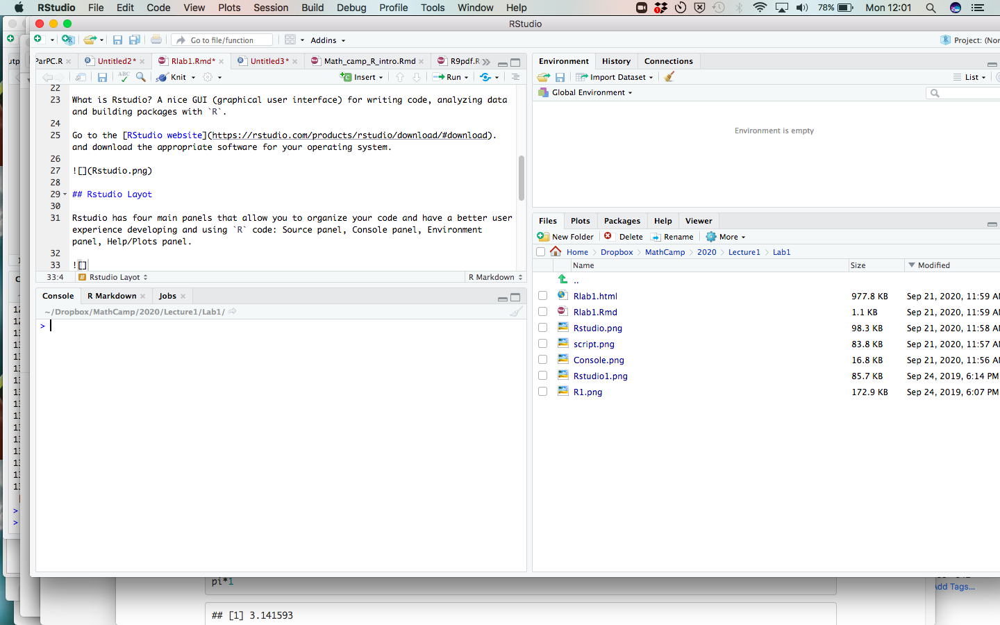
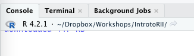

```{r setup, echo = FALSE}
knitr::opts_chunk$set(echo = TRUE)
knitr::opts_knit$set(root.dir = '~/Dropbox/Workshops/IntrotoRIII/Intro-to-R-III')
```

# Getting started 
## Download R

What is `R`? Open-source, free, statistical computing software.

Go to the [R website](https://cran.r-project.org/), and download the appropriate software for your operating system.


## Download RStudio

What is Rstudio? A nice GUI (graphical user interface) for writing code, analyzing data and building packages with `R`.

Go to the [RStudio website](https://rstudio.com/products/rstudio/download/#download) and download the appropriate software for your operating system.


## Rstudio Layout

Rstudio has four main panels that allow you to organize your code and have a better user experience developing and using `R` code: 

  * **Source panel:** edit scripts (`.R`, `.Rmd`, and `.md` among others)
  * **Console panel:** executed code and print output
  * **Environment panel:** view existing objects
  * **Files/Plots/Help:** navigate files and folders, view plots, read and access help documentation for packages and functions



# RMarkdown

Markdown is a simple formatting syntax for authoring HTML, PDF, and MS Word documents. For more details on using RMarkdown see <http://rmarkdown.rstudio.com>. RMarkdown (`.Rmd`) files are Markdown (`.md`) files designed for use with RStudio. `knitr` is a [package developed by Yuhui Xie](https://yihui.org/knitr/) that allows one to typeset these `.Rmd` documents and facilitate the incorporation of code and computational output. This is helpful for writing labs for you all to follow along with, but also to create reproducible and replicable research. It allows you to avoid writing scripts to produce all your output and, then, copying and pasting that output into a separate word processing software which may induce unnecessary errors.

Go to File $\rightarrow$ New File $\rightarrow$ RMarkdown. Select `Knit to HTML`


It will open up a new template .Rmd file for you to begin editing that will look like this:\


When you click the **Knit** button a document will be generated that includes both content as well as the output of any embedded `R` code chunks within the document. You can embed an `R` code chunk like this:

```{r knit_ex, eval = FALSE}
data(cars)
summary(cars)
```


A handy Rstudio/RMarkdown cheatsheet can be found here <https://rstudio.com/wp-content/uploads/2016/03/rmarkdown-cheatsheet-2.0.pdf>. It gives summaries of the most used Markdown syntax aspects (e.g. headings/subheadings, bullet lists, numbered lists), the types of files RMarkdown can create and examples of how `R` and RMarkdown interact.

This is an example of an an RMarkdown file that will be used to create a .html file. This is the best option if you don't have much math to write or do not need to share a .pdf.

## Why use RMarkdown?

* **Reproducibility:** the results in the final .html, .pdf, or .docx document come directly from the code included in the `.Rmd` file
* **Replicability:** a collaborator or another researcher or student can directly replicate your analysis using the code contained in the chunks, and there is room for much more commentary than in a regular `.R` script.
* **Debugging:** every time you knit a `.Rmd` file, it executes the code from start to finish in a clean environment. `knitr` will not compile if there are errors in the `R` code, the Markdown syntax or, if we are making a .pdf, the LaTeX code.

## Chunks

While not nicely named, `R` code can be included in an RMarkdown file in what we call a "chunk". Properties of the chunk are adjusted within the curly braces. The cheatsheet under the heading "Embed code with knitr syntax". The most common arguments I use are

  *  `echo`: logical argument determining whether the code in the subsequent chunk will be printed in the document created
  *  `eval`: logical argument determining whether or not the code in the subsequent chunk will be evaluated by `R` or just printed in the document.
  *  `fig.cap`: provides a caption for a figure
  *  `fig.align`: aligns figure on "left", "right" or "center"

```{r pressure, echo=FALSE, fig.align = 'center', fig.cap = "For example, this figure was created with `echo = FALSE` and `eval = TRUE`."}
plot(pressure)
```

Chunks allow you to break up your code into smaller pieces that a reader can understand. It's great for writing reports/homeworks so that you can include code immediately followed by its output.\

## `purl()`

You can use the function `purl()` on a .Rmd document and it will create a new `.R` file with only the `R` code in the chunks. Copy and paste the following code line by line into your document to create a document called `IntroToRIII_20231102.R` containing only the `R` code in this document.

```{r, eval = F}
install.packages('knitr')
library(knitr)
purl('IntroToRIII_20231102.Rmd')
```

## Formatting

All of this is available on the cheat sheet, but here we will briefly cover basic text and document formatting.

### Bold/Italics
Use asterisks (`*`) around a word or phrase to make it *italicized*.

Use double asterisks (`**`) around a word or phrase to make it **bold**.

In RMarkdown, these formatting tools will create highlighted text.

### Math mode

If you want to write equations you can use (`$`) like in LaTeX.

Wrap an equation in a single `$` to write an equation in "math mode": $y = x$.

Wrap an equation in double dollar signs (`$$`) to make an equation block in math mode: $$ y = x $$.

In a .pdf file you can also include raw LaTeX code, and use and equation or align environment:

\begin{equation}
y = x.
\end{equation}

# Plotting in R

Data visualization is a powerful tool for understanding your data and teasing out relationships.  This lab will illustrate how to visualize the distribution of variables as well as associations between variables using base `R` and the `tidyverse` plotting package.

For this lab, we will use two important packages:
- `dplyr` to manage and manipulate our data
- `ggplot2` to actually produce the visualizations

To see all of the cool data visualization that you can do in `R`, visit the `R` Graph Gallery:
https://www.r-graph-gallery.com/

```{r, warning = F, message = F}
#install.packages("ggplot2")
#install.packages('palmerpenguins')
library(ggplot2)
library(palmerpenguins)
```

The data for this lab can be accessed through a package called `palmerpenguins`, which contains data on penguins' species, island, and body dimensions. This dataset will not actually appear in the global environment when you load the `palmerpenguins` library, but it is still accessible. 

We will start by examining some descriptive statistics for each variable using the `summary()` command.

```{r iris}
summary(penguins)
```

## Examining a single variable (univariate plots)

Oftentimes, we want to know how our quantitative variable is distributed in the data.  Histograms provide handy way to do this.  In base `R`, we simply use the `hist()` command.  This is going to give us a very rough looking plot, but it's sufficient for exploratory data analysis (i.e. to get a sense of the typical case, whether and how the data is skewed).

Note that the `echo = FALSE` parameter in the code chunk to prevent printing of the `R` code that generated the plot.

### Histograms using base `R`

```{r, echo=FALSE}
hist(penguins$flipper_length_mm)
```

If we were inclined to present this graph to an audience, we would want to clean it up, including changing titles, axis labels, the size of the "bins", and the color of the bars. For a more extensive list of the colors that you can choose, visit the following website: https://www.nceas.ucsb.edu/sites/default/files/2020-04/colorPaletteCheatsheet.pdf

```{r iris sepal, echo=FALSE, tidy =T}
hist(penguins$flipper_length_mm,
     main = "Histogram of Flipper Length (in mm)",   #main title of the graph
     xlab = "Flipper Length",                #x-axis label (can also use ylab for y-axis label)
     col = "purple4",                      #change color of the bars
     breaks = 45)                          #alter the number of bins
```

**Question**
What do you notice happened when we changed the bin width in the second histogram?  How might this be important to us as researchers?

### Histograms in `ggplot2`

We can also use `ggplot2` to plot this variable.  "gg" stands for "grammar of graphics"; the `ggplot2` package treats plots as an additive series of characteristics.  The first line generally indicates (a) what dataset you are using and (b) what variable(s) will go into the aesthetics.  Subsequent lines indicate the type of graph to be created (in this case, a histogram), different color attributes of the graph, axis titles and limits, et cetera.  

The code in the first chunk is the simplest possible version of the histogram.

```{r, warning = F, message = F, error = F}
ggplot(penguins, aes(x = flipper_length_mm)) +
  geom_histogram()
```

Again, it is not the most visually pleasing graph, but we can add features easily.

```{r}
ggplot(penguins, aes(x = flipper_length_mm)) +
  geom_histogram(fill = "darkgoldenrod", #alter the fill color of the bars
                 color = "white") +      #alter the outline color of the bars
  ggtitle("Distribution of Flipper Length") +
  xlab("Flipper Length") +
  ylab("Frequency") +
  theme_minimal()     #changes the background theme.  The default is grey.
  
```

### Bar graphs in base `R`

Sometimes we're interested in visualizing a **categorical** variable  In the case of the `penguins` dataset, 

We'll first use base `R` and then `ggplot2` to create the bar plots. In base `R`, you must first convert your data into a table as we have done above.  

```{r}
#Summarize # of penguins from each 
#island in a table
counts <- table(penguins$island)

#Create the plot
barplot(counts) 
```

This plot tells you how many observations (a.k.a. penguins) originated from each island.

We can add some bells and whistles to this plot in base `R` as well.

```{r}
barplot(counts, 
        main = "Island of Origin",
        col = "mediumpurple2",
        ylab = "Frequency")
```

### Barplots in `ggplot2`
In `ggplot2`, we will use the `geom_bar()` command. In `ggplot2`, we do not need to tabulate the data prior to plotting, which is handy. 

```{r}
ggplot(penguins, aes(x = island)) +
  geom_bar(fill = "darkblue") +
  xlab("Island of Origin") +
  ylab("Frequency") +
  theme_bw()    #note the difference in background with this theme
```

### Grouped bar plots in `ggplot2`

What if we want to observe the relationship between two categorical variables?  In this case, we will examine the number of penguins of each species originating from each island. We can do so using a **grouped bar plot**. This is particularly straightforward to implement using `ggplot2`, but we will need to use `dplyr` to construct a summary tally of penguins by species and island and use that to make the graph.

```{r}
#Make a quick summary table of penguins
#by island:
library(dplyr)
library(tidyr)
species_by_island <- penguins %>%
  group_by(species, island) %>%
  tally()

#Graph out the summary table using ggplot2:
ggplot(species_by_island, aes(x = species, y = n, fill = island)) +
  geom_bar(stat = "identity", position = "dodge") +
  xlab("Island of Origin") +
  ylab("Number of individuals of each species") +
  theme_bw()    
```

We can also examine variable averages by group using a similar strategy as above.  This time, we'll look at average flipper length by island.  Again, we need to start by manipulating the data.

```{r}
#summarize average flipper length by island
flippers_by_island <- penguins %>%
  group_by(island) %>%
  summarize(mean_flipper_length = mean(flipper_length_mm, na.rm = T))

#graph it out:
ggplot(flippers_by_island, aes(x = island, y = mean_flipper_length, fill = island)) +
  geom_bar(stat = "identity", position = "dodge") +
  xlab("Island of Origin") +
  ylab("Frequency") +
  theme_bw() + 
  theme(legend.position = "none")  +  #use this last line to get rid of the legend 
  scale_fill_manual(values = c("purple4", "darkgoldenrod", "black"))
```

## Scatterplots in base `R`

To observe relationships between two numeric variables, we use scatterplots (also known as scattergrams).  Say we want to observe the relationship between a penguin's body mass (`body_mass_g`) and the length of its flippers (`flipper_length_mm`).

```{r}
plot(penguins$body_mass_g, penguins$flipper_length_mm,
     xlab = "Body mass (in g)",
     ylab = "Flipper Length (in mm)",
     frame = FALSE, #removes the boundary that R automatically puts on a scatterplot
     pch = 19)  #specifies the type of dot
```


```{r}
plot(penguins$flipper_length_mm,
     penguins$body_mass_g,
     xlab = "Flipper length (mm)",
     ylab = "Body Mass (g)",
     main = "",
     pch = 2, col = 'red')
```

### Saving directly to `.pdf`

#### The Working Directory
To open files in `R` we need to specify the directory our data files are stored in. There are two ways to do this: using code or via the dropdown menus (this will vary by Windows or Mac).

Rstudio shows you what your current working directory is by looking at the file path at the top of the Console pane. 

**Note:** `~` refers to your home directory.



You can also find out what's in your working directory OR navigate to and specify the folder you would like to be your working directory in the Files/Plots/Packages/Help/Viewer/Presentation pane.


You can set your working directory manually in the Console or in a `.R` script with the function `setwd()`. The function `getwd()` will show you the current working directory.

```{r, eval = FALSE}
getwd()
setwd("~/Dropbox/Workshops/IntrotoRIII/")
```

However, the `setwd()` function is insufficient for `.Rmd` files. To set the working directory in your `.Rmd` document, you will need to include the following line of code:

```{r, eval = FALSE}
knitr::opts_knit$set(root.dir = "~/Dropbox/Workshops/IntrotoRIII/")
```

```{r pdf}
pdf("Figures/WeightvsHeight.pdf",
    height = 4, width = 4)
plot(penguins$flipper_length_mm,
     penguins$body_mass_g,
     xlab = "Flipper length (mm)",
     ylab = "Body Mass (g)",
     main = "",
     pch = 2, col = 'red')
dev.off()
```

### Making custom plot limits

```{r plot_lims}
max(penguins$flipper_length_mm)
max(penguins$flipper_length_mm, na.rm = TRUE)

xlimits <- c(min(penguins$flipper_length_mm,
                  na.rm = TRUE)-1,
              max(penguins$flipper_length_mm,
                  na.rm = TRUE)+1)
ylimits <- c(min(penguins$body_mass_g,
                  na.rm = TRUE)-1,
              max(penguins$body_mass_g,
                  na.rm = TRUE)+1)

plot(penguins$flipper_length_mm[penguins$species == "Adelie"],
     penguins$body_mass_g[penguins$species == "Adelie"],
     xlim = xlimits,
     ylim = ylimits,
     xlab = "Flipper length (mm)",
     ylab = "Body Mass (g)",
     pch = 2, col = 'navyblue')
points(penguins$flipper_length_mm[penguins$species == "Chinstrap"],
       penguins$body_mass_g[penguins$species == "Chinstrap"],
       pch = 19, col = 'deeppink',
       lwd = 2)
points(penguins$flipper_length_mm[penguins$species == "Gentoo"],
       penguins$body_mass_g[penguins$species == "Gentoo"],
       pch = 21, col = 'deepskyblue',
       bg = alpha('deepskyblue', 0.5))
legend('topleft', pch = c(2,19,19), 
       lwd = c(1,2,1), lty = c(NA, NA,NA),
       col = c("navyblue",
               "deeppink",
               alpha("deepskyblue",.5)),
       legend = c("Adelie",
                  "Chinstrap",
                  "Gentoo"), bty = 'n')
```

### Multi-pane plots in base `R`

```{r par_mfrow}
par(mfrow = c(1,3))
plot(penguins$flipper_length_mm[penguins$species == "Adelie"],
     penguins$body_mass_g[penguins$species == "Adelie"],
     xlim = xlimits,
     ylim = ylimits,
     xlab = "Flipper length (mm)",
     ylab = "Body Mass (g)",
     main = "Adelie",
     pch = 19, col = 'navyblue')
plot(penguins$flipper_length_mm[penguins$species == "Chinstrap"],
     penguins$body_mass_g[penguins$species == "Chinstrap"],
     xlim = xlimits,
     ylim = ylimits,
     xlab = "Flipper length (mm)",
     ylab = "Body Mass (g)",
     main = "Chinstrap",
     pch = 19, col = 'deeppink')
plot(penguins$flipper_length_mm[penguins$species == "Gentoo"],
     penguins$body_mass_g[penguins$species == "Gentoo"],
     xlim = xlimits,
     ylim = ylimits,
     xlab = "Flipper length (mm)",
     ylab = "Body Mass (g)",
     main = 'Gentoo',
     pch = 19, col = 'deepskyblue')
```

### Multi-page pdf in base `R` with `for` loops

```{r multi_pdf}
titles <- c("Adelie", "Chinstrap", "Gentoo")
colors <- c("navyblue", "deeppink", "deepskyblue")

pdf("Figures/MassvsFlipper_species.pdf", height = 4, width = 4)
for(i in 1:3){
  par(mfrow = c(1,1))
  plot(penguins$flipper_length_mm[penguins$species == titles[i]],
     penguins$body_mass_g[penguins$species == titles[i]],
     xlim = xlimits,
     ylim = ylimits,
     xlab = "Flipper length (mm)",
     ylab = "Body Mass (g)",
     main = titles[i],
     pch = 2, col = colors[i])
}
dev.off()
```


## Scatterplots in `ggplot2`

We also might want to add a regression line to our scatterplot. While you can certainly do this in base `R`, the `ggplot2` method is given below.

```{r ggplot_point, warning = F, message = F}
ggplot(penguins, aes(x = body_mass_g, y = flipper_length_mm)) +
  geom_point() +
  xlab("Body Mass (in g)") +
  ylab("Flipper length (in mm)") +
  theme_classic() +
  geom_smooth(method = lm, color = "red", se=FALSE) 
#lm = linear model
#se = whether or not to include standard error estimates
```

### Grouped scatter plots

We can also observe how species might impact the relationship between body mass and flipper length using the grouping method. Here, we assign the dots of each species their own color.  You can also distinguish categories using different levels of shading, different shapes, or even different sizes of points (https://www.r-graph-gallery.com/274-map-a-variable-to-ggplot2-scatterplot.html).

```{r, warning = F, message = F}
ggplot(penguins, aes(x=body_mass_g, y=flipper_length_mm, color=species)) + 
    geom_point(size=6) +
    theme_minimal() +
  scale_color_manual(values = c("purple4", "darkgoldenrod", "black"),
                     ## Change legend title
                     name = "Species") +
  xlab("Body mass (in g)") + 
  ylab("Flipper length (in mm)")
```

This plot gives us a new perspective on the data: we see that the relationship between body mass and flipper length is quite different for the Gentoo species, as compared with the Adelie and Chinstrap species.  


### `facet_wrap`

```{r, warning = F, message = F}
penguins %>% 
  ggplot(aes(x=body_mass_g, y=flipper_length_mm, color = species)) + 
  geom_point(size=2) +
  facet_wrap(~species) +
  theme_minimal() +
  guides(color = guide_legend(title = "Species")) +
  xlab("Body mass (in g)") + 
  ylab("Flipper length (in mm)")
```

**Question** What do you think the code below does differently than the previous example?
```{r, eval = FALSE, warning = F, message = F}
penguins %>% 
  ggplot(aes(x=body_mass_g, y=flipper_length_mm)) + 
  geom_point(size=2) +
  facet_wrap(~species) +
  theme_classic() +
  xlab("Body mass (in g)") + 
  ylab("Flipper length (in mm)")
```

## Saving a plot in `ggplot2`

```{r ggsave, warning = F, message = F}
peng_plot <- penguins %>% 
  ggplot(aes(x=body_mass_g, y=flipper_length_mm, color = species)) + 
  geom_point(size=2) +
  facet_wrap(~species) +
  theme_minimal() +
  guides(color = guide_legend(title = "Species")) +
  xlab("Body mass (in g)") + 
  ylab("Flipper length (in mm)")

ggsave(peng_plot, filename = "Figures/MassvsFlipperLength_ggplot.pdf")
```

# Practice: Data manipulation \& Plotting

  1. Create a new variable in the dataset to represent the ratio of bill length to depth.
  2. Plot your new variable in a boxplot and change the color of the inside of the boxplot. HINT: see `?boxplot` or `?geom_boxplot`.
  3. Write a loop that makes 3 3-panel plots saved to 3 individual files. Each plot/file will represent an island and each panel of each plot will plot the bill length against bill depth for a species. Within each panel, points will be colored by sex. Make sure your legends, titles, and axis labels are properly capitalized and neat.

